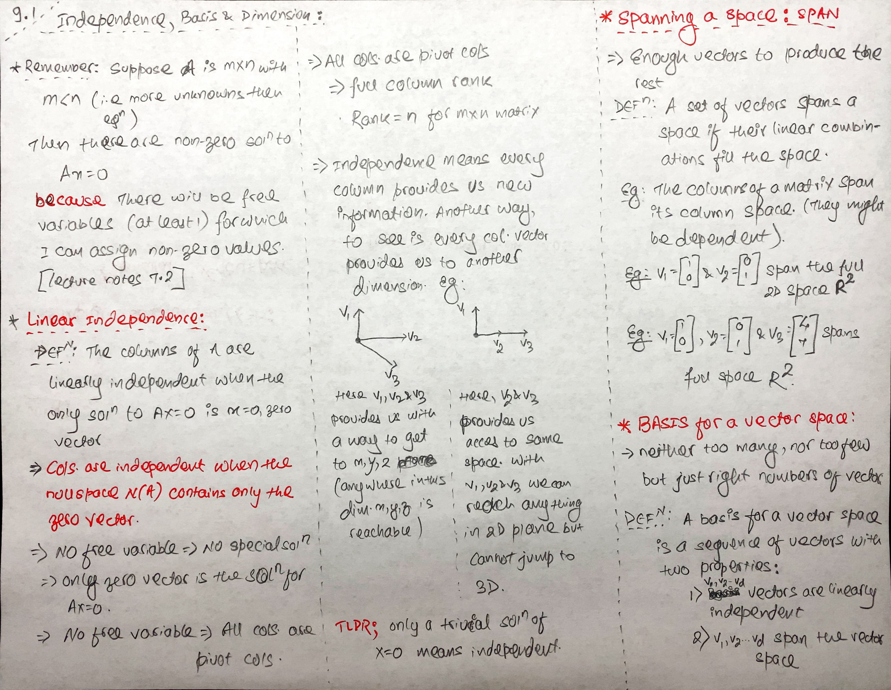
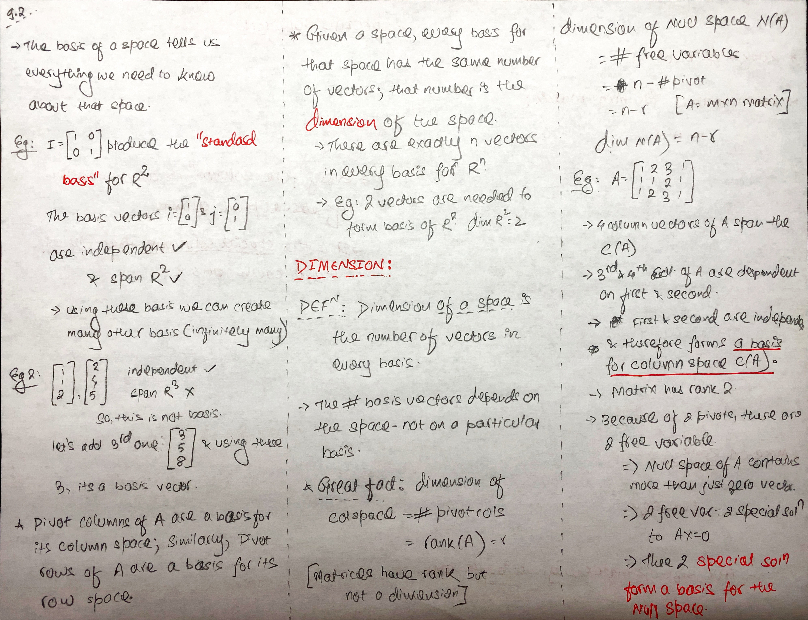

## TLDR:

- A set of vectors `span` space if their linear combination fills the space.
- Then the question, is what kind of vectors can span a space (aka fill the space?).
  - `Basis` Vectors are the right kind of vectors that can fill the space
  - Standard basis are the common basis vectors and it is easy to see that these vectors are linearly independent
- How many of these basis vectors do I need to fill the said space?
  - The answer is that it depends on the space. For eg, in R2 there are 2 vectors.
  - The number of vectors that a basis needs in order to span space is called `dimension`
- TRIVIA:
  - DIMENSION of col space = # pivot cols = rank of matrix = r
  - DIMENSION of null space = # free variables = n - r
