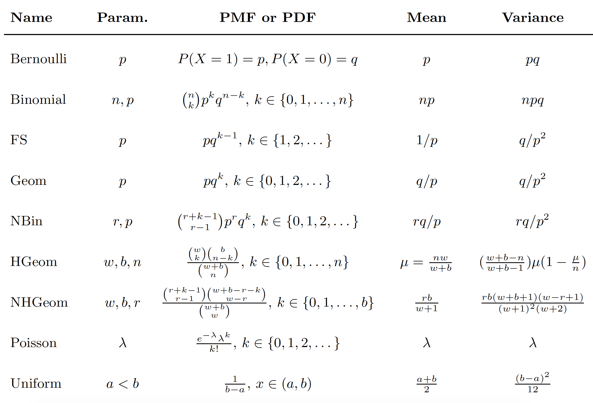
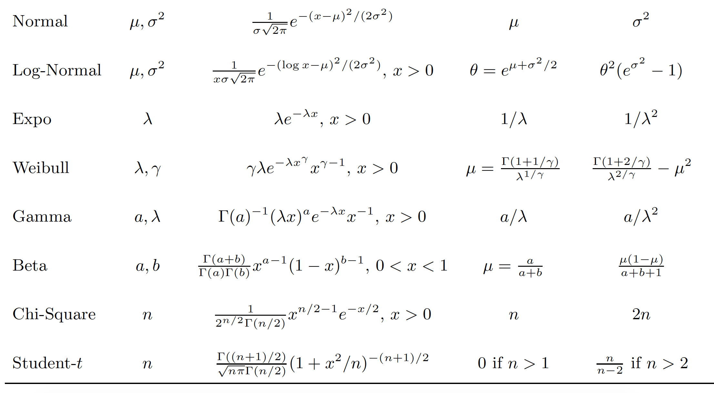

# Course

This course notes is based on `Stat - 110` from Harvard.

# Course Content

- [Website](https://projects.iq.harvard.edu/stat110/home)

- [Lecture in youtube](https://www.youtube.com/watch?v=KbB0FjPg0mw&list=PL2SOU6wwxB0uwwH80KTQ6ht66KWxbzTIo)

- [Animation videos](https://www.youtube.com/watch?v=gJZYgLyjyIQ&list=PL2qHyNjtf9vO5fAiRKlBlXksc4B5TK_F0)

- [Book Used](http://probabilitybook.net)

  Introduction to Probability by Joe Blitzstein and Jessica Hwang;

# Similar course

- MIT also has lecture available that covers similar material:

  https://ocw.mit.edu/resources/res-6-012-introduction-to-probability-spring-2018/

- [Lecture in youtube](https://www.youtube.com/watch?v=1uW3qMFA9Ho&list=PLUl4u3cNGP60hI9ATjSFgLZpbNJ7myAg6)

# Section notes

## [2. Conditional Probability](./2)

## [3. Discrete Random Variable](./3)

## [4. Expectation](./4)

## [5. Continuous Random Variable](./5)

## [7. Joint Distributions](./7)

# Summary of Various Distributions

| Name                        | Dist                    | Description                                                                                                                                                                                                                                                                                                                                                                                                                                                                                                                                                                                |
| --------------------------- | ----------------------- | ------------------------------------------------------------------------------------------------------------------------------------------------------------------------------------------------------------------------------------------------------------------------------------------------------------------------------------------------------------------------------------------------------------------------------------------------------------------------------------------------------------------------------------------------------------------------------------------ |
| `Bernoulli Trial`           | X ~ Bern(p)             | To model success or failure of a trial                                                                                                                                                                                                                                                                                                                                                                                                                                                                                                                                                     |
| `Bernoulli RV`              | X ~ Bern(p)             | To quantify success - 1 or failure - 0 in a single Bernoulli Trial                                                                                                                                                                                                                                                                                                                                                                                                                                                                                                                         |
| `Binomial dist`             | X ~ Bin(n,p)            | Number of success in 'n' Bernoulli trials; (once is not enough; so try n times and count success)                                                                                                                                                                                                                                                                                                                                                                                                                                                                                          |
| `Hypergeometric dist`       | X ~ HGeom(w,b,n)        | Picking colored balls from jar w/o replacement; 2 tags - initial color white or black & if selected; w+b is total initial choice; from that we need to pick n balls randomly w/o replacement                                                                                                                                                                                                                                                                                                                                                                                               |
| `Discrete Uniform dist`     | X ~ DUnif(c)            | Choose a number uniformly at random from a set of numbers - c; all the numbers have same probability making this a discrete uniform distribution                                                                                                                                                                                                                                                                                                                                                                                                                                           |
| `Geometric dist`            | X ~ Geom(p)             | Number of failures before first success; (mnemonic: go grab beer right after first success)                                                                                                                                                                                                                                                                                                                                                                                                                                                                                                |
| `First Success dist`        | Y ~ FS(p)               | Number of trials including the first successful trial. This is same as Geom RV + 1                                                                                                                                                                                                                                                                                                                                                                                                                                                                                                         |
| `Negative Binomial dist`    | X ~ NBin(r, p)          | - Number of failures before the rth success; (mnemonic: now that you succeeded once with Geom and grabbed a beer let's try it again until we succeed at least r times so that we know we can make this really work!)   - The `reason this is called negative binomial` is because, in binomial we count number of success in fixed number of trials where as in negative binomial we count number of failures until a fixed number of success occurs; in other words, binomial fixes number of trials to do and in negative binomial number of success to achieve is fixed. |
| `Uniform dist`              | U ~ Unif(a,b)           | A uniform r.v on the interval (a,b) is a completely random number between a & b                                                                                                                                                                                                                                                                                                                                                                                                                                                                                                            |
| `Normal dist`:              |                         | - aka `Bell curve` or `Gauss/Gaussian dist`.   - Comes in two flavors: `Standard normal` & `General Normal` distribution.   - `68-95-99.7%` benchmark for the probabilities of falling with `1σ` or `2σ` or `3σ` from the mean                                                                                                                                                                                                                                                                                                                                                     |
| &nbsp; `1. General Normal`  | X ~ N(μ, σ2) | μ is the mean and σ2 is the variance                                                                                                                                                                                                                                                                                                                                                                                                                                                                                                                                            |
| &nbsp; `2. Standard Normal` |  Z ~ N(0, 1)            | with 0 mean and 1 as variance; notice it gets its own special symbol! Z & N. Similarly &‌#966; from PDF and &‌#934; for CDF                                                                                                                                                                                                                                                                                                                                                                                                                                                                |

# Table of distributions - Pulled from Appendix C of the book

# Additional Useful links for stats

- [Stat Quest](https://www.youtube.com/user/joshstarmer)
- [Brandon Foltz](https://youtube.com/c/BrandonFoltz)
- [Dr. Trefor Bazett](https://www.youtube.com/c/DrTreforBazett/playlists)
